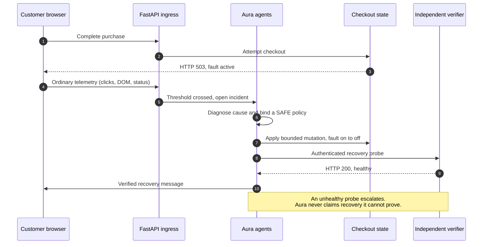
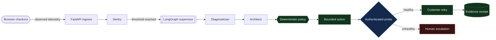
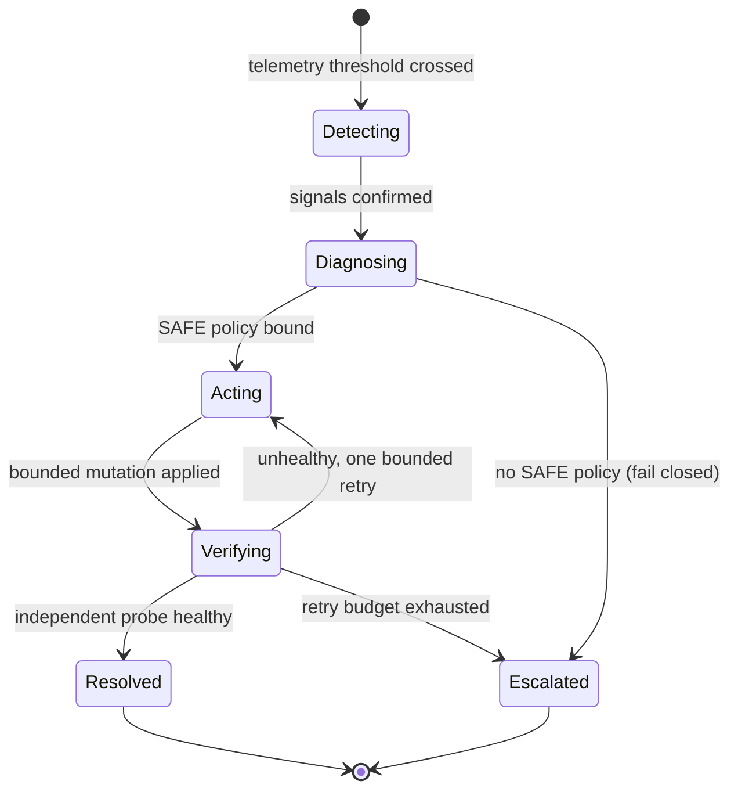

# Aura

**Trustworthy autonomous remediation with evidence before claims.**


<p align="center">
  
</p>
<p align="center"><em>Aura can act &mdash; but evidence decides what it is allowed to claim.</em></p>

Aura is a local proof of concept for a difficult operational promise: an autonomous system may act, but it cannot call an incident resolved until independent evidence says the affected journey is healthy.

The model does not choose infrastructure actions. Deterministic policy does. Unsafe paths fail closed, recovery language is gated by verification, and every terminal outcome receives a tamper-evident evidence receipt.

## Why Aura

Most remediation demos stop at a tool returning `success`. Aura tests the **outcome** instead: it only claims recovery after an independent probe re-observes the affected journey as healthy.



The failed request, the mutation, the probe, and the customer retry all use the **same** tenant-scoped local checkout state. If a tool reports success while the service stays unhealthy, Aura escalates and withholds every word of recovery language.

## See It in Action

| Closed loop, proven | Tamper-evident receipt |
| :---: | :---: |
|  |  |
| Root cause on the causal graph, the live `503 -> action -> 200` proof with a retained mutation ID, and four accountable decision stages. | A SHA-256 hash chain over every evidence entry, verified server-side, alongside identity-free recurrence memory. |

**Refusal is a first-class outcome.** When no SAFE policy covers the fault, Aura leaves the dependency degraded, blocks the action, and tells the customer the truth instead of fabricating a resolution.


## Quick Start

### Requirements

- Python 3.12
- Windows PowerShell for the commands below
- Docker Desktop only for the optional Redis and Neo4j topology

### Run locally

```powershell
python -m venv .venv
.\.venv\Scripts\python.exe -m pip install -r backend\requirements.txt
.\.venv\Scripts\python.exe -m uvicorn app.main:app --app-dir backend --host 127.0.0.1 --port 8000
```

Open <http://127.0.0.1:8000> and select **Run guided demo**.

The walkthrough preserves one continuous incident across four evidence stages:

1. A real local checkout request returns a measured `HTTP 503`.
2. Deterministic policy applies one bounded mutation and verifies `HTTP 200`.
3. A separate customer retry returns `HTTP 200`.
4. The server recomputes and verifies the recovery receipt hash chain.

The **Stop run** control aborts an in-flight request without claiming recovery. Receipt inspection remains available through **Open receipt** after completion.

### Run the executable proofs

```powershell
.\.venv\Scripts\python.exe run_live_telemetry_scenario.py
.\.venv\Scripts\python.exe run_escalation_scenario.py
.\.venv\Scripts\python.exe run_demo_scenario.py
```

Each script exits nonzero when a required invariant is missing.

## What Is Real

- Browser clicks, DOM mutations, request status, and elapsed time enter the normal telemetry API.
- The faulted checkout performs a real same-origin HTTP request and returns a delayed `503`.
- Detection, graph traversal, policy evaluation, mutation, verification, escalation, replay, and receipt verification execute as implemented.
- The action changes the same bounded tenant state read by the public checkout route.
- The verifier reaches that route through authenticated FastAPI request handling.
- A fresh customer retry exercises the public route again after recovery.
- A healthy request remains below threshold and opens no incident.

## What Is Demonstration Data

- Customer identities, the checkout product, service topology, and revenue values
- The deliberately injected local dependency fault
- Redis and Kubernetes effects in local mode
- Jira-style ticket delivery
- The local demo credential

Aura does **not** claim production deployment, production Kubernetes access, durable enterprise identity, or multi-region reliability.

## Architecture



Every incident advances through the same accountable lifecycle, and no path reaches `Resolved` without passing independent verification:



The runtime is Python-only. FastAPI serves native HTML, CSS, JavaScript, Canvas, and SVG, so the dashboard has no npm dependency or frontend build step.

## Safety Invariants

- Models can write bounded customer and incident text; they cannot select or approve actions.
- Every mutation passes through a registered tool policy.
- Unknown tools and invalid arguments fail closed.
- Cache operations are restricted to `checkout_session:*`.
- Rollback requires explicit human approval tied to an immutable plan digest.
- Tool acknowledgement alone cannot resolve an incident.
- Recovery communication requires a healthy independent observation.
- Failed remediation gets one bounded retry, then escalates.
- Tenant/session windows, runtimes, queues, history, request sizes, and idempotency state are bounded.
- Every terminal incident receives a deterministic evidence receipt.

## Project Layout

```text
backend/app/          FastAPI API, agents, policy, evidence, and runtime
backend/static/       Native dashboard HTML, CSS, and JavaScript
backend/tests/        Unit, integration, safety, and truth tests
docs/                 Architecture, verification, and demo documentation
run_*_scenario.py     Executable end-to-end proof scripts
docker-compose.yml    Optional Redis, Neo4j, API, and tool-gateway topology
```

## Testing

```powershell
.\.venv\Scripts\python.exe -m pytest backend\tests -q
```

Current verified result: **122 passed** with one upstream Starlette `TestClient` deprecation warning.

The two most important regressions prove:

- A measured five-second `HTTP 503` at the exact `0.800` fault threshold enters diagnosis without relying on incidental DOM timing.
- A successful tool response with an unhealthy independent probe escalates instead of producing a false recovery claim.

## Optional Docker Topology

```powershell
Copy-Item .env.example .env
docker compose up --build
```

This starts Aura, Redis Streams, Neo4j, and the isolated mock infrastructure gateway. Docker configuration is included, but the final local verification report does not claim an executed Docker integration because Docker Desktop was unavailable during that run.

## Documentation

| Document | Purpose |
| --- | --- |
| [Documentation index](docs/README.md) | Map of user, operator, architecture, and evidence docs |
| [Architecture](docs/architecture.md) | State, equations, graph flow, and failure semantics |
| [Demo runbook](docs/demo-runbook.md) | A concise judge and presentation sequence |
| [Verification report](docs/verification-report.md) | Executed evidence and remaining limitations |
| [What we built](WHAT_WE_BUILT.md) | Plain-language scope and honesty boundary |
| [Contributing](CONTRIBUTING.md) | Development workflow and pull-request expectations |
| [Security](SECURITY.md) | Vulnerability reporting and demo security boundaries |
| [Support](SUPPORT.md) | Where to ask questions and what diagnostic data to include |

Interactive API documentation is available at <http://127.0.0.1:8000/api/docs> while Aura is running.

## Community

Please read [CONTRIBUTING.md](CONTRIBUTING.md) and [CODE_OF_CONDUCT.md](CODE_OF_CONDUCT.md) before opening a pull request. Use the security process in [SECURITY.md](SECURITY.md) for vulnerabilities rather than filing a public issue.

## Project Status

Aura is a tested local trust proof, not a production SRE platform. Production adoption still requires enterprise identity, managed secrets, durable storage, real infrastructure adapters, deployment hardening, load testing, and reliability validation.

## License

Released under the [MIT License](LICENSE).
